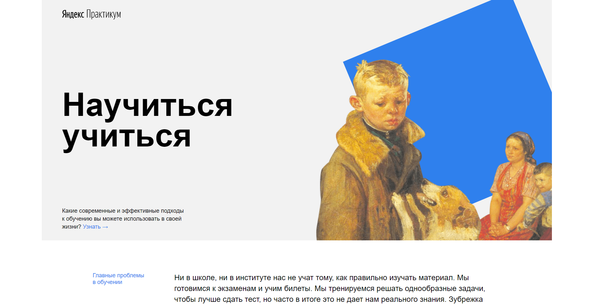

# Проект: [Научиться учиться](https://hotess.github.io/how-to-learn/)

Описание проекта
--------------------

Проект о методах, которые помогают эффективнее изучать сложную тему.

Используемые технологии
-----------------------------------
* Флексбокс;
* Фигма;
* Оптимизация картинок;
* Гит;
* Разработан по методологии **БЭМ**.
